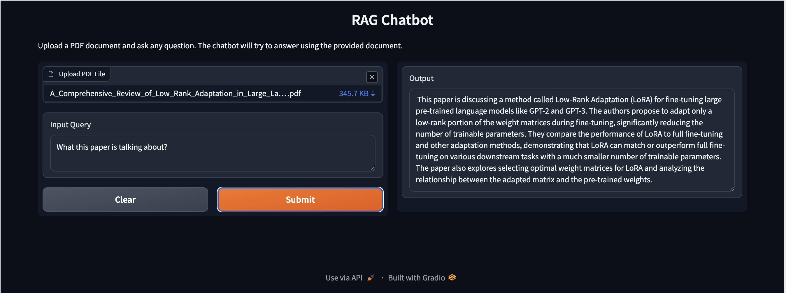

This chatbot is a Retrieval-Augmented Generation (RAG) system built with Python, Gradio, and LangChain, leveraging IBM Watsonx Foundation Models for both embedding and text generation.

- Users upload PDF documents, which are processed using PyPDFLoader and RecursiveCharacterTextSplitter to create manageable text chunks.

- Watsonx embeddings are applied to the chunks and stored in a Chroma vector database, enabling semantic search for relevant content.

- Queries are passed to a Watsonx LLM (mixtral-8x7b-instruct-v01) via LangChain’s RetrievalQA chain, which generates accurate, context-aware responses based on the uploaded documents.

- The frontend is a Gradio interface, providing an interactive, user-friendly experience for asking questions and viewing answers instantly.

---
You can find the code for this project on my Github:
[Github Repo](https://github.com/Chan-McLaren/PDF_QA_Bot)

---
[Back to AI Engineering]()