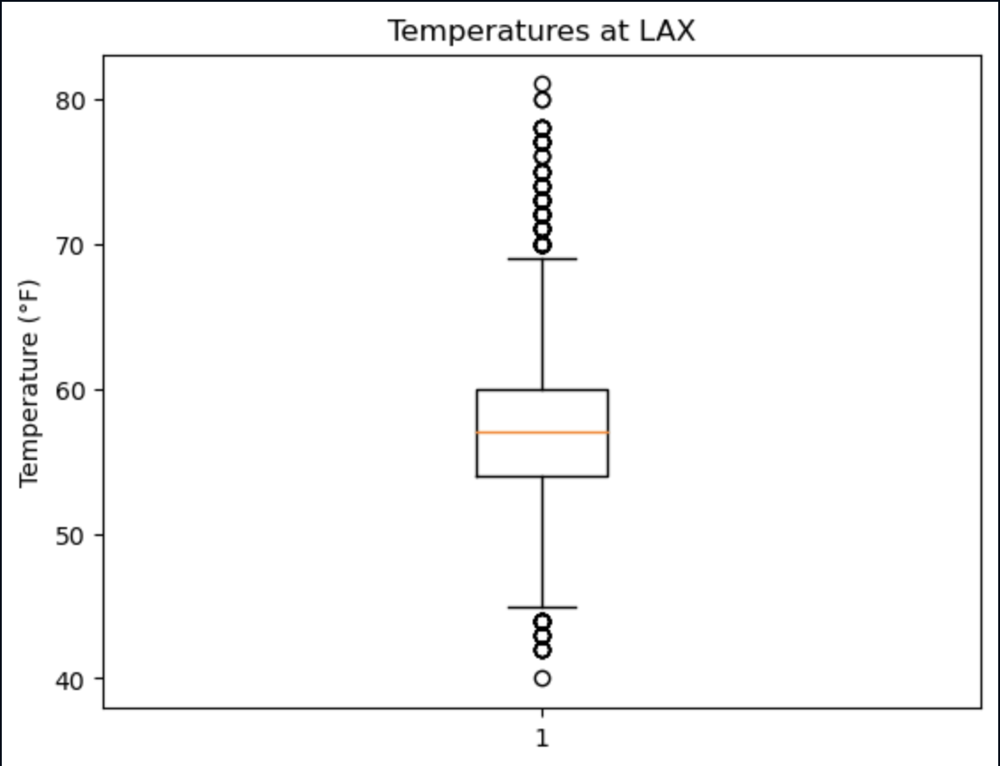
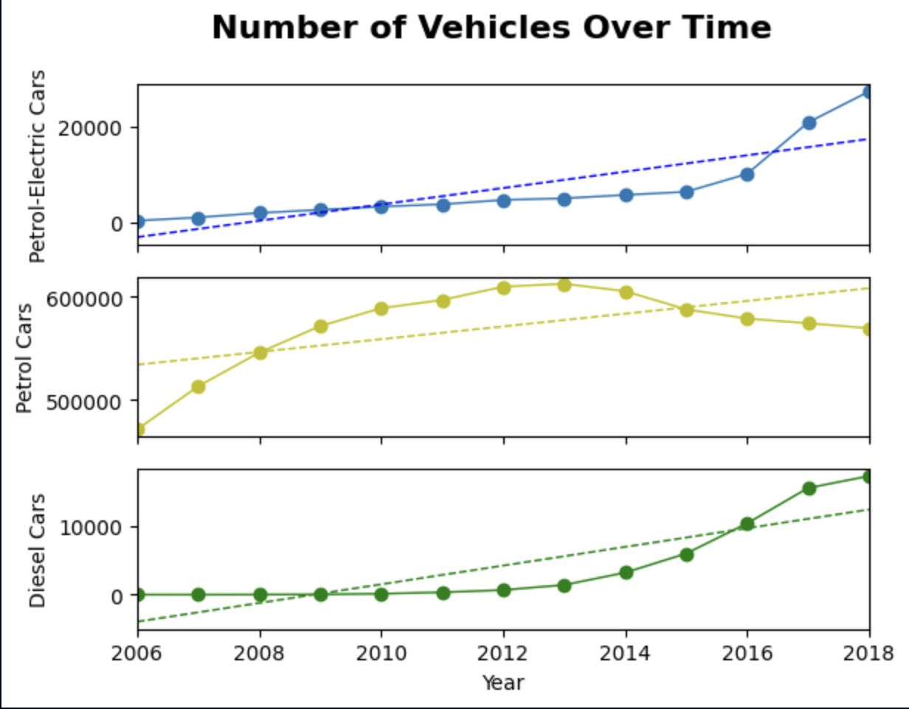
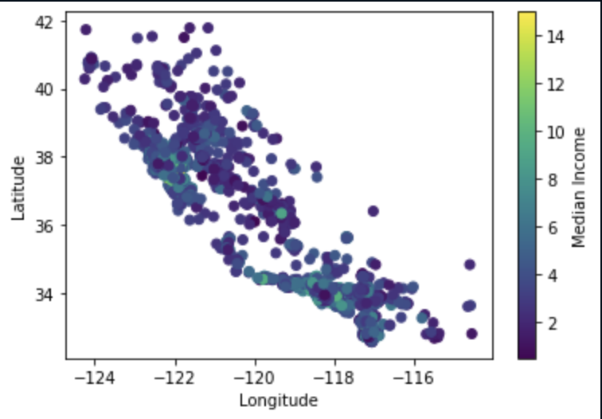
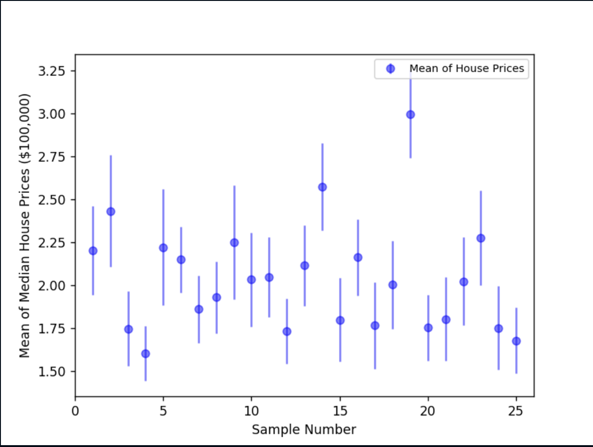
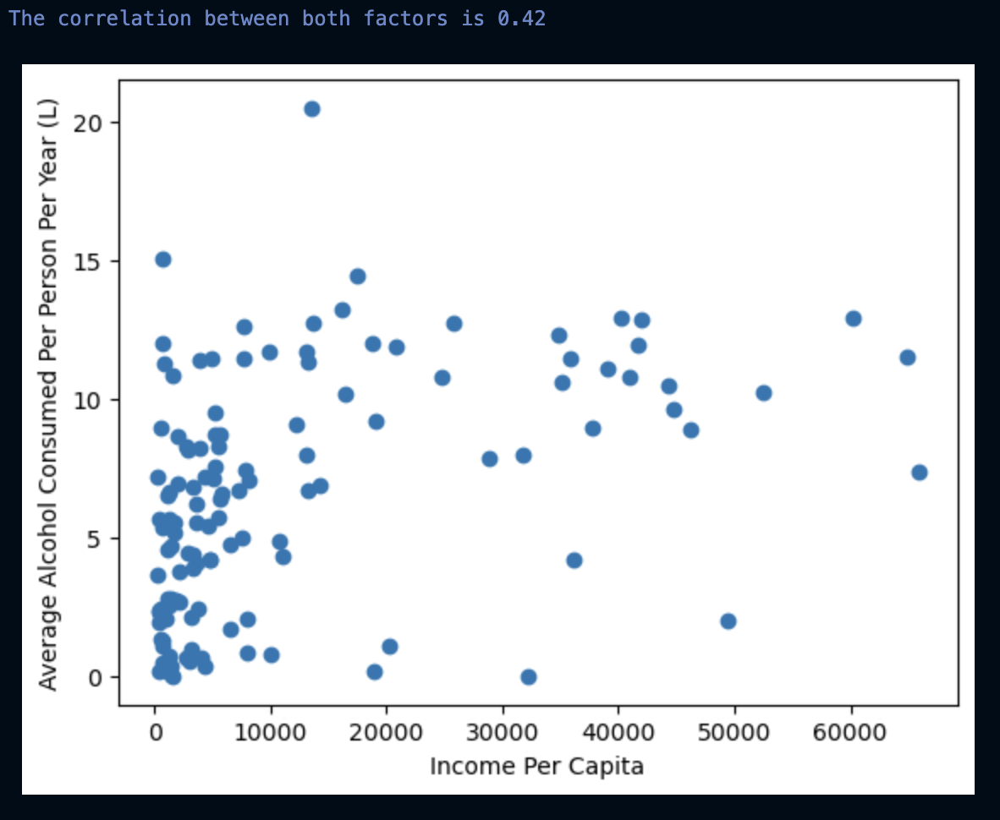
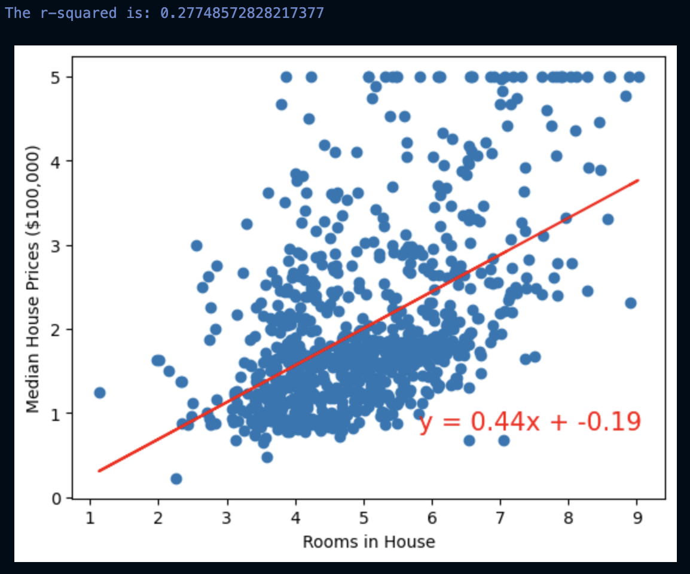
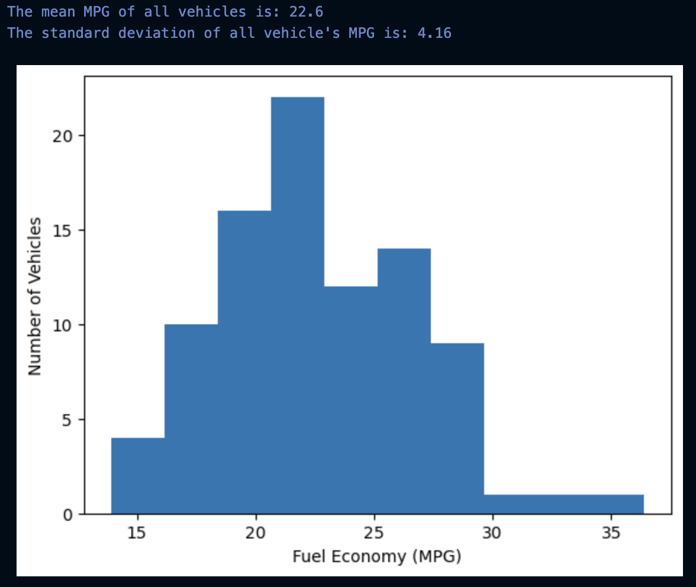

## Statistical Analysis 
The following gallery showcases Python-based visualizations designed to highlight key statistical concepts and analytical techniques. Some visuals focus on exploratory data analysis, such as box plots to identify outliers, facet plots for vehicle comparisons, and gradient scatter plots to illustrate median income across locations. Other visualizations demonstrate more advanced statistical analysis, including scatter plots with regression lines to compute R-squared values, correlation charts to quantify relationships between variables, and bar charts of MPG with associated standard deviations to analyze changes in mean values.

 
 

 



---
You can find a project using the methods shown in this gallery in my
[Github Repo](https://github.com/Chan-McLaren/Pymaceuticals-Inc.-Capomulin-)

---
[Back to Analytics and Visualizations]()