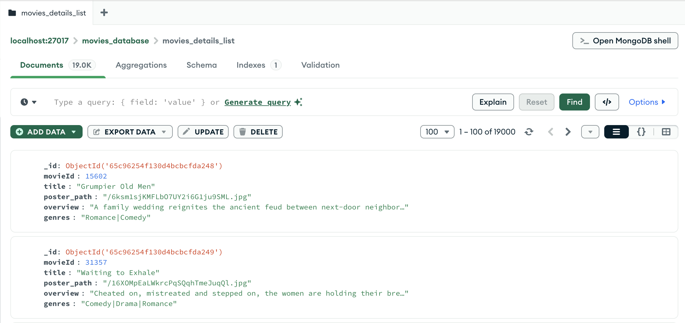
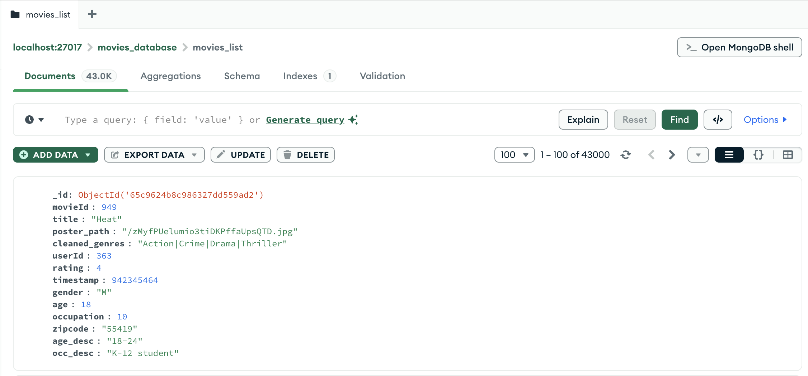
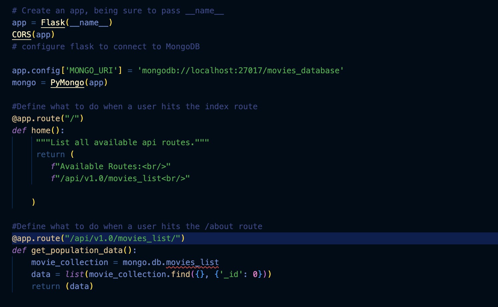
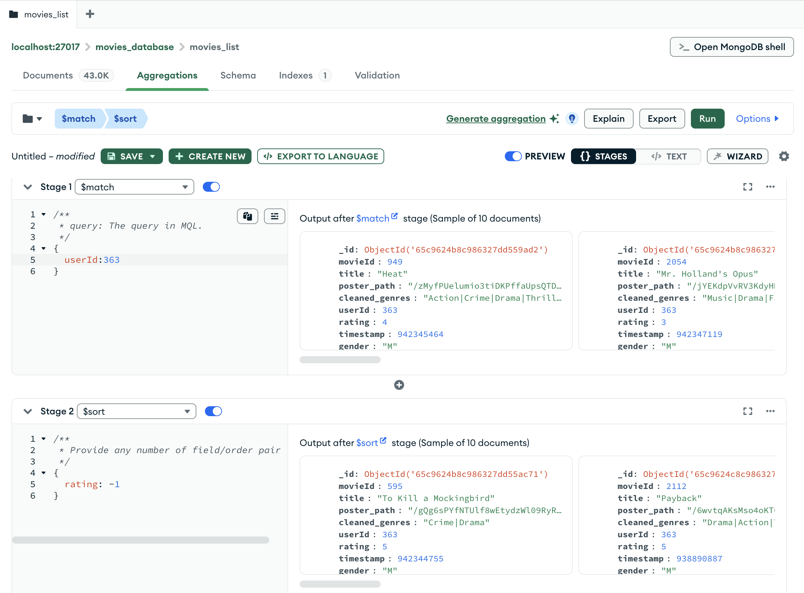

A full-stack movie recommendation system built by a team of 4, combining MongoDB for data management, Flask API for serving predictions, and a frontend for user interaction. MongoDB played a critical role as the database layer—storing cleaned datasets, enabling efficient queries, and acting as the bridge between raw movie/user data and the ML-powered recommendations.

## Data Flow
 
 


- Raw data was collected, cleaned and transformed in Python.
- Stored structured collections in MongoDB.
- Mongo served as the central data hub, queried by Flask to power recommendations.

## MongoDB Schema
Standard JSON Format

MongoDB Format

- Collections: movie details (titles, genres, overview, poster paths).
- Collections: user preferences (IDs, ratings, interaction history).
- A flexible MongoDB schema allowed for easy addition of new features and data sources.
- No rigid schema, allowing for fast iteration during preprocessing and model tuning.

## Flask API to MongoDB

- Flask API connects to MongoDB (pymongo/MongoClient).
- Queries user history and movie features directly form Mongo collecitons.
- Ensures real-time data access for personalized recommendations.

## Example Query in MongoDB (Aggregation Pipeline)

- Used aggregations in Mongo to filter through collections.

## Endpoint
- User enters ID, frontend sends request to Flask API.
- Flask retrieves data from MongoDB colections, runs ML models, returns recommendations.
- Mongo connects the raw data to the personalized predictions.

---
You can find the code for this project in my
[Github Repo](https://github.com/Chan-McLaren/Movie_Recommendation_Model)

---
[Back to Data Engineering]()